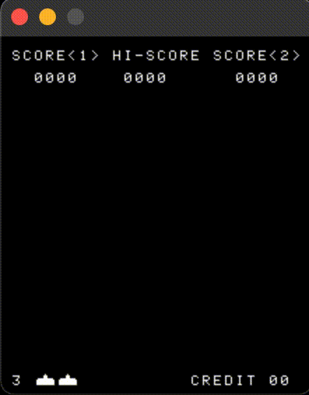

# Emulating the Intel 8080

[Emulator 101](http://emulator101.com/)



## Build

This depends on SDL2 for rendering graphics. So, on macOS with Homebrew:

```bash
brew install sdl2
```

Then, to build:

```bash
make
```

Or with another C compiler:

```bash
CC=clang make
```

With debug symbols:

```bash
make clean && make debug
```

## Run

For the first argument, takes the folder containing `invaders.h`, `invaders.g`, etc. So with the following folder structure,

```plain
├── intel8080
├── invaders
    ├── invaders.e
    ├── invaders.f
    ├── invaders.g
    └── invaders.h
```

the command would be:

```bash
./intel8080 invaders
```

To step through one instruction at a time, use the `-s` option:

```bash
./intel8080 -s invaders
```

### Controls

Currently only single player mode is supported. The mappings are as follows:

|Action|Button|
|:---:|:---:|
|Insert coin|<kbd>C</kbd>|
|Start|<kbd>Enter</kbd>|
|Left|<kbd>←</kbd>|
|Right|<kbd>→</kbd>|
|Fire|<kbd>Space</kbd>|

## References

* [Computer Archeology](http://computerarcheology.com/Arcade/SpaceInvaders/Hardware.html)
* [8080 opcodes](http://www.emulator101.com/reference/8080-by-opcode.html)
* [8080 assembly programming manual](http://altairclone.com/downloads/manuals/8080%20Programmers%20Manual.pdf)
* [This JavaScript implementation](https://bluishcoder.co.nz/js8080/)
* [superzazu's excellent C implementation](https://github.com/superzazu/8080)
